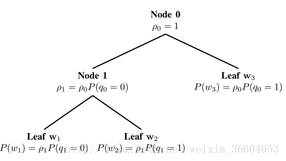

# fastText
## 1.introduction
 FastText是一种Facebook AI Research在16年开源的一个文本分类器。 其特点就是fast。相对于其它文本分类模型，如SVM，Logistic Regression和neural network等模型，fastText在保持分类效果的同时，大大缩短了训练时间，下面也会介绍缩短时间的原理。
## 2.原理
###### FastText方法包含三部分：模型架构、层次 Softmax 和 N-gram 特征。
 fastText 模型输入一个词的序列（一段文本或者一句话)，输出这个词序列属于不同类别的概率。 序列中的词和词组组成特征向量，特征向量通过线性变换映射到中间层，中间层再映射到标签。 fastText 在预测标签时使用了非线性激活函数，但在中间层不使用非线性激活函数。 fastText 模型架构和 Word2Vec 中的 CBOW 模型很类似。不同之处在于，fastText 预测标签，而 CBOW 模型预测中间词。 
###### 第一部分
   fastText的模型架构类似于CBOW，两种模型都是基于Hierarchical Softmax，都是三层架构：输入层、 隐藏层、输出层。一个简单的神经网络结构，但是和常见的神经网络不同的是fastText的输入层到隐藏层没有非线性激活函数，在最后一层输出层的时候采用了非线性激活预测标签。该模型将一系列单词作为输入并产生一个预定义类的概率分布。我们使用一个softmax方程来计算这些概率。当数据量巨大时，线性分类器的计算十分昂贵，所以fastText使用了一个基于霍夫曼编码树的分层softmax方法。常用的文本特征表示方法是词袋模型，然而词袋（BoW）中的词顺序是不变的，但是明确考虑该顺序的计算成本通常十分高昂。作为替代，fastText使用n-gram获取额外特征来得到关于局部词顺序的部分信息。
###### 第二部分
层次之间的映射：将输入层中的词和词组构成特征向量，再将特征向量通过线性变换映射到隐藏层，隐藏层通过求解最大似然函数，然后根据每个类别的权重和模型参数构建Huffman树，将Huffman树作为输出。
最大似然函数简要介绍：最大似然函数估计法，首先是假设所得的样本服从某一分布，目标是估计出这个分布中的参数，方法是得到这一组样本的概率最大时就对应了该模型的参数值，写出似然函数，再求对数（得到对数似然），再求对数似然函数的平均（对数平均似然），再对其求导，得出参数值。
分层softmax的目的是降低softmax层的计算复杂度。
二叉树。Hierarchical softmax本质上是用层级关系替代了扁平化的softmax层，如下图所示，每个叶子节点表示一个词语（即霍夫曼树的结构）。

我们可以把原来的softmax看做深度为1的树，词表V中的每一个词语表示一个叶子节点。如果把softmax改为二叉树结构，每个word表示叶子节点，那么只需要沿着通向该词语的叶子节点的路径搜索，而不需要考虑其它的节点。这就是为什么fastText可以解决不平衡分类问题，因为在对某个节点进行计算时，完全不依赖于它的上一层的叶子节点（即权重大于它的叶结点），也就是数目较大的label不能影响数目较小的label（即图5中B无法影响A和C）。
###### 第三部分
N-gram
常用的特征是词袋模型，词袋模型不考虑词之间的顺序，因此 fastText 还加入了 N-gram 特征。“我爱你”的特征应当是“我”、“爱”、“你”。那么“你爱我”这句话的特征和“我爱你”是一样的，因为“我爱你”的bag（词袋）中也是只包含“你”、“爱”、“我”。
还是那句话——“我爱你”：如果使用2-gram，这句话的特征还有 “我-爱”和“爱-你”，这两句话“我爱你”和“你爱我”就能区别开来了，因为“你爱我”的2-gram的特征还包括“你-爱”和“爱-我”，这样就可以区分“你爱我”和“我爱你”了。为了提高效率，实务中会过滤掉低频的 N-gram。否则将会严重影响速度。
在fastText 中一个低维度向量与每个单词都相关。隐藏表征在不同类别所有分类器中进行共享，使得文本信息在不同类别中能够共同使用。这类表征被称为词袋（bag of words）（此处忽视词序）。在 fastText中也使用向量表征单词 n-gram来将局部词序考虑在内，这对很多文本分类问题来说十分重要。

