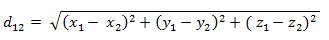
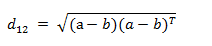

# word2vec
### 1.methods of compute similarity
#### 1.1 cosine similarity 

#### 1.2 Euclidean distance
欧氏距离是最易于理解的一种距离计算方法，源自欧氏空间中两点间的距离公式。
(1) 二维平面上两点a(x1,y1) 与 b(x2,y2)间的欧氏距离：

(2) 三维空间两点a(x1,y1,z1)与b(x2,y2,z2)间的欧氏距离：

(3) 两个n维向量a(x11,x12,…,x1n)与 b(x21,x22,…,x2n)间的欧氏距离：

也可以用表示成向量运算的形式：
